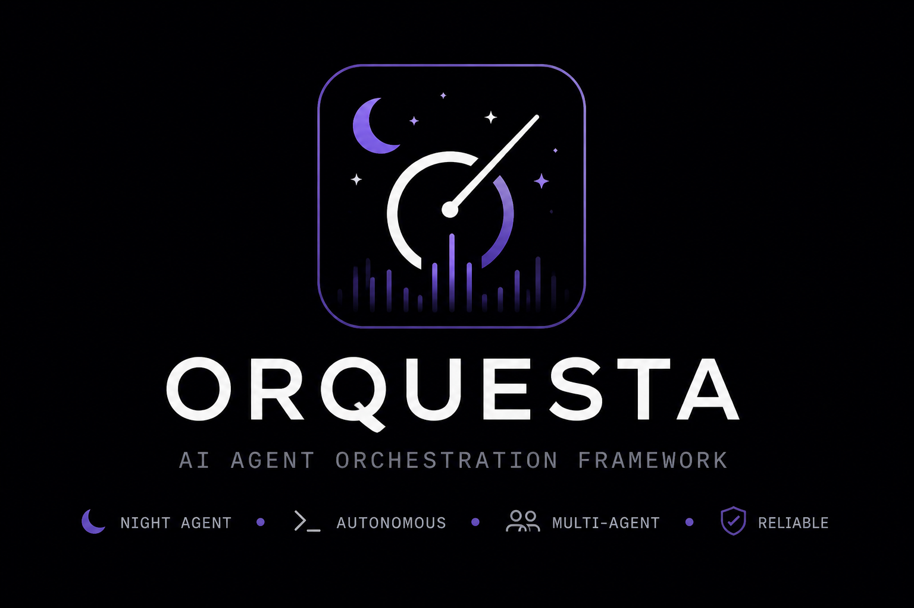

# Orquesta



Orquesta is a web control plane for `orq-lite`: a Next.js console plus a FastAPI backend for managing projects, runs, flows, and teams.

## Frontend

```bash
pnpm install
pnpm exec next dev --webpack --port 3000
```

Open `http://localhost:3000/dashboard`.

The console works with mock data by default. Set these environment variables to connect live services:

- `ORQ_LITE_API_URL`: a single `orq-lite serve` instance.
- `ORQUESTA_API_URL`: the Python control-plane API.

## Backend

```bash
uv run uvicorn 'orquesta_api.main:create_app' --factory --reload --port 8000
```

Useful backend settings:

- `DATABASE_URL`: SQLAlchemy async URL, defaults to local SQLite.
- `FLOWS_PATH`: path to `flows.json`, defaults to `./flows.json`.
- `TEAM_PATH`: path to `team.json`, defaults to `./team.json`.
- `RUN_EXECUTOR`: run executor, currently `local` by default.

## Flow And Team Admin

- `/dashboard/flows` manages `flows.json` entries used by `orq-lite flow run <name>`.
- `/dashboard/team` manages the default `team.json` roster used by `orq-lite` roles, agents, prompts, and gates.

When `ORQUESTA_API_URL` is configured, saves go through `/api/control-plane/*` to the FastAPI backend. Without it, the screens remain usable as local drafts with mock data.
