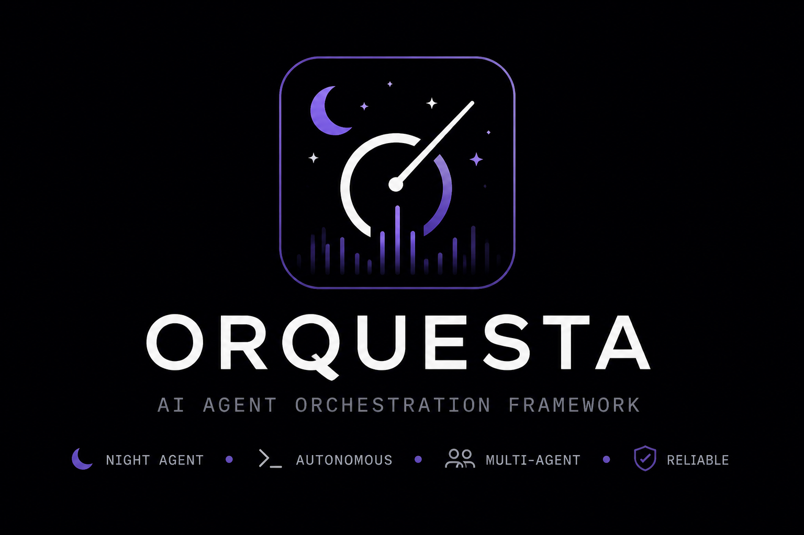

# Orquesta

<p align="center">
  
</p>

> Local multi-agent orchestration daemon for coding workflows in TypeScript.

Orquesta is a Bun/TypeScript multi-agent orchestration daemon. Day mode produces a Task DAG outside the daemon, then Orquesta ingests that DAG and drives it through `coder → tester → critic → fix` waves inside isolated git worktrees. Resident `pm` and `architect` consultants answer worker questions during each wave, then `architect / pm / qa` validate at iteration boundaries and may emit refinement tasks. State is persisted as JSON + a SQLite event journal under `.orquesta/crew/`.

Three optional front-ends ship in this repo:
- In-process React Web UI
- Standalone Web UI server
- Go (Bubble Tea) TUI

> **Architecture:** see `docs/ARCHITECTURE.md` (full) and `docs/ARCHITECTURE.min.md` (condensed).  
> Agents working on the codebase should also read `AGENTS.md`.

---

# ✨ Features

- Multi-agent orchestration (`coder → tester → critic → fix`)
- DAG-based execution model
- Isolated git worktrees per task
- Persistent execution state (JSON + SQLite journal)
- Built-in CLI (`orq`)
- Web UI + TUI
- MCP-compatible interface
- Iterative refinement loops with validation roles

---

# 🧠 Concept

Orquesta separates **planning** from **execution**:

- **Day mode** → generates a DAG of tasks
- **Daemon mode** → executes that DAG through agent waves

This allows:
- deterministic execution
- reproducibility
- observability
- iterative improvement cycles

---

# 🚀 Quickstart

```bash
bun install
bun run build
orq start
```

In another terminal:

```bash
orq skill install --target all
orq run start ./orquesta-run.json
orq status
```

---

# 📦 Requirements

- Bun ≥ 1.3.5
- Git
- Go ≥ 1.22 (only if building the TUI)
- One of:
  - `claude`
  - `codex`
  - `gemini`

---

# 🛠 Install dependencies

```bash
bun install
cd tui && go mod download && cd ..
```

---

# 🏗 Build

| Artifact | Command | Output |
|---|---|---|
| Daemon | `bun run build:daemon` | `dist/daemon/` |
| Web UI | `bun run build:ui` | `dist/ui/` |
| CLI | `bun run build:cli` | `dist/orq` |
| TUI | `bun run build:tui` | `dist/orq-tui` |

Build everything:

```bash
bun run build
```

Full check:

```bash
bun run check
```

---

# 🔧 Install CLI (`orq`)

```bash
bun run build:cli

mkdir -p ~/.local/bin
ln -sf "$(pwd)/dist/orq" ~/.local/bin/orq

orq doctor
```

---

# 🧩 CLI Commands

| Command | Description |
|---|---|
| `orq run start <file>` | Start run from DAG |
| `orq run cancel` | Cancel run |
| `orq skill install` | Install DAG builder |
| `orq migrate` | Archive old state |
| `orq start` | Start daemon |
| `orq status` | Show plan |
| `orq logs` | Tail events |
| `orq doctor` | Diagnostics |

---

# ▶️ Running Orquesta

## A) Daemon only

```bash
orq start
```

API available at:

http://127.0.0.1:8000

---

## B) Daemon + Web UI

```bash
bun run build:ui
orq start
```

Open:

http://127.0.0.1:8000

---

## C) Daemon + TUI

```bash
bun run build:tui
orq start
dist/orq-tui
```

---

# 📄 Example DAG

```json
{
  "prompt": "Refactor auth module to JWT",
  "max_iterations": 2,
  "tasks": [
    {
      "id": "auth-jwt",
      "title": "Refactor auth",
      "description": "Replace session auth with JWT",
      "depends_on": []
    },
    {
      "id": "auth-tests",
      "title": "Add tests",
      "description": "Test JWT flow",
      "depends_on": ["auth-jwt"]
    }
  ]
}
```

---

# ⚙️ Configuration

`.orquesta/crew/config.json`

```json
{
  "team": [
    {
      "role": "coder",
      "cli": "codex",
      "model": "gpt-5.5"
    }
  ]
}
```

---

# 🌐 Environment Variables

| Var | Default | Description |
|---|---|---|
| `ORQ_PORT` | 8000 | Server port |
| `ORQ_HOST` | 127.0.0.1 | Bind address |
| `ORQ_CORS_ORIGIN` | - | CORS |
| `ORQ_AUTONOMOUS` | false | Auto answers |
| `ORQ_DAEMON_URL` | localhost | TUI target |

---

# 🏗 Project Structure

```
src/agents/
src/api/
src/bus/
src/cli/
src/core/
src/daemon/
src/mcp/
src/ui/
src/ui-server/
src/test/
tui/
templates/
scripts/
```

---

# 🔌 Extending

## Add a role

- Update `src/core/types.ts`
- Add template in `templates/roles/`
- Register in CLI

## Add a CLI

- Add adapter in `src/agents/adapters/`
- Register in index

---

# 🧭 Architecture

See:

- `docs/ARCHITECTURE.md`
- `docs/ARCHITECTURE.min.md`

---

# 🤝 Contributing

PRs welcome.

---

# 📄 License

MIT (or define)
