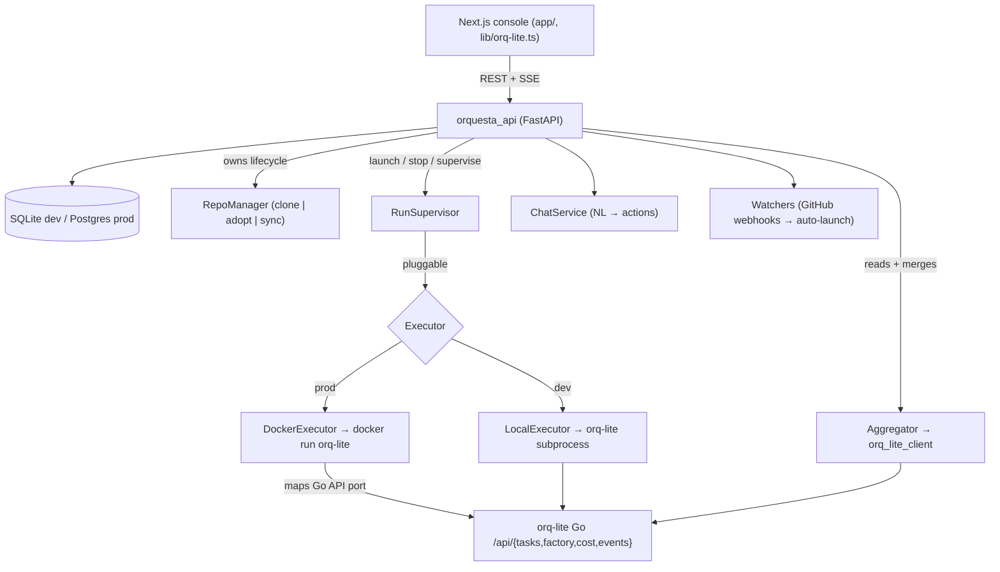
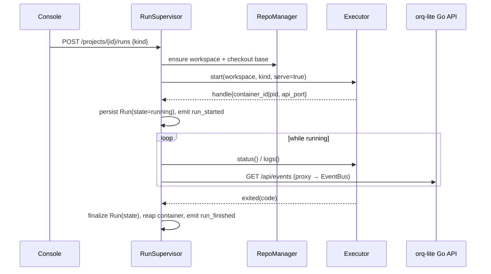

# Backend Control-Plane API — Feature Spec

Date: 2026-06-28
Status: proposed
Service: `orquesta_api` (Python / FastAPI)

This document specifies the **Python backend API** that integrates `orq-lite`
with the Next.js web console. It is the **multi-project control plane**: it owns
a project/repo registry, launches and supervises `orq-lite` runs through a
pluggable executor (Docker or local subprocess), and aggregates each run's Go
`/api/*` state into one multi-project view and live event stream for the
frontend.

It is a catalog of every capability the frontend needs to consume orquesta
**runs**, **repositories**, **docker containers**, and aggregated **state**. The
feature groups are phased (P1–P4) but live in one spec because they share one
data model and one service.

> The existing Go server (`orq-lite serve`, `internal/web/server.go`) stays as
> the **per-run** state source. This control plane sits *above* many such
> servers. It does not replace them.

---

## 1. The big picture

`orq-lite` is single-project: one process, one `.orquestalite/` state dir, one
repo, one embedded Go HTTP server. The web console (`app/`, `lib/types.ts`) is
**multi-project**: a project registry, factory queues, run launching, watcher
toggles, and a global chat. The gap between them is this control plane.



**Roles of each subsystem:**

| Subsystem | Responsibility | Lives in |
| --- | --- | --- |
| `RepoManager` | Clone a repo by URL or adopt an existing path; fetch/checkout the base branch; report status; prune. | `services/repos.py` |
| `RunSupervisor` | Launch a run, record its container/pid + mapped port, poll status, tail logs, finalize on exit. | `services/runs.py` |
| `Executor` | Abstract start/stop/logs/status/inspect. Two backends: Docker, local subprocess. | `meta/executor.py`, `executors/` |
| `Aggregator` | Read a run's Go `/api/*` and merge it into the project view; re-emit its SSE events onto the control-plane bus. | `services/aggregator.py` |
| `EventBus` | Fan out lifecycle + run events to global and per-project SSE subscribers. | `services/events.py` |
| `ChatService` | Turn natural-language messages into control-plane actions (register project, toggle watch, launch run). | `services/chat.py` |
| `Watchers` | Receive GitHub PR/issue webhooks and auto-launch runs for watched projects. | `services/watchers.py` |

---

## 2. Scope

**In scope (v1, phased):**

- **P1 — Projects + repos + runs + events.** Project/repo registry (CRUD),
  repo clone/adopt/sync, launch/stop/list runs, aggregated task/feature/cost
  state, and live event + log streaming over SSE. This replaces the frontend's
  mock data and makes the console live.
- **P2 — Docker container management.** Container-level controls beyond runs:
  list, inspect status/health, stream logs, stop/restart, image pull/build.
- **P3 — Admin chat backend.** A `/chat` endpoint that backs `global-chat.tsx`
  and can register projects, toggle watchers, and launch runs from natural
  language.
- **P4 — Auth + watchers.** Bearer-token auth middleware and the GitHub
  PR/issue watcher subsystem that auto-launches runs on repository events.

**Out of scope (later specs):**

- Replacing the Go `orq-lite serve` HTTP server (the control plane wraps it).
- A Prefect-based durable run orchestrator (FastAPI supervises runs directly in
  v1; revisit if durability/retries demand it — see `collectiveai-prefect.md`).
- User accounts / RBAC / multi-tenant org model (single shared bearer token in
  v1).
- Editing `orq-lite` config (`team.json`, prompts) through the API.
- Cost attribution beyond what `orq-lite`'s `/api/cost` already rolls up.

---

## 3. Architectural decisions

These were settled during design; they shape every feature below.

1. **Control plane, not replacement.** Python orchestrates *many* `orq-lite`
   instances and aggregates their Go APIs. The Go server remains the per-run
   source of truth for tasks/factory/cost/diff/results.
2. **Pluggable executor.** An `ExecutorInterface` with a `DockerExecutor`
   (prod) and a `LocalExecutor` (dev), selected by `RUN_EXECUTOR`. Lets the team
   develop without Docker and deploy with it.
3. **Repos: both modes, auto-detected.** A project with a `repo_url` is cloned
   and managed under `workspaces_dir/<project>`; a project pointing at an
   existing `workspace_path` is adopted in place; both given → clone into that
   path.
4. **FastAPI + SQLAlchemy.** SQLite for dev, Postgres for prod, one `DATABASE_URL`.
   Pydantic v2 models mirror `lib/types.ts` field-for-field so the frontend needs
   no shape translation.
5. **Project-scoped endpoints.** Multi-project means state endpoints are nested
   under `/projects/{id}/…` rather than the Go server's flat `/api/tasks`. The
   frontend's `lib/orq-lite.ts` is updated to match (see §11).

---

## 4. Package layout (Collective AI Python house style)

Flat layout, package at repo root, `meta/` for ABCs and boundary-crossing
Pydantic models, external services wrapped under `core/integrations/`. See
`docs/conventions/collectiveai-python.md`.

```
orquesta_api/
  __init__.py
  main.py                 FastAPI app factory; mounts routers; lifespan (db init, executor wiring)
  config.py               Settings(BaseSettings) singleton
  logger/
    logger.py             get_logger wrapper (rich), reads LOG_LEVEL
  meta/                   abstract layer: ABCs + shared Pydantic models
    models.py             Project, Repo, Run, Task, Feature, RunEvent, Container, ChatMessage + str/Enum sets
    executor.py           ExecutorInterface (ABC)
  db/
    session.py            engine, SessionLocal, get_session dependency
    tables.py             SQLAlchemy ORM: ProjectRow, RunRow, RepoRow, EventCursorRow
  executors/
    docker.py             DockerExecutor
    local.py              LocalExecutor
  services/
    projects.py           project registry CRUD
    repos.py              RepoManager: clone | adopt | sync | status | prune
    runs.py               RunSupervisor: launch | stop | status | logs | finalize
    aggregator.py         merge a run's Go /api/* into the project view
    events.py             EventBus: SSE fan-out (global + per-project)
    chat.py               ChatService: NL → actions
    watchers.py           GitHub webhook handling → auto-launch
  core/
    integrations/
      orq_lite_client.py  httpx client for the Go /api/*
      docker_client.py    wraps the docker SDK
      git.py              clone / fetch / checkout / status (subprocess git)
      github.py           webhook verification + event parsing
  routers/
    projects.py  repos.py  runs.py  events.py  containers.py  chat.py  auth.py
test/
  …                       pytest; LocalExecutor + fake orq-lite server fixtures
```

---

## 5. Data model

Pydantic v2 models in `meta/models.py` mirror `lib/types.ts` so responses drop
straight into the frontend. Finite string sets are `class X(str, Enum)` (house
rule — never bare string literals). Persistent rows live in `db/tables.py`;
boundary objects are always Pydantic.

### 5.1 Enums (must match `lib/types.ts` values exactly)

| Enum | Values |
| --- | --- |
| `TaskStatus` | `pending`, `in_progress`, `done`, `failed`, `needs_human`, `decomposed`, `needs_clarification` |
| `VerifyState` | `""`, `pending`, `tests_pass`, `tests_fail`, `tests_skipped`, `pass`, `error`, `commit_ok`, `commit_rejected`, `commit_skipped`, `commit_empty` |
| `AgentRole` | `parser`, `coder`, `tester`, `critic`, `reviewer` |
| `FeatureStatus` | `pending`, `in_progress`, `done`, `failed`, `needs_human` |
| `ProjectState` | `running`, `idle`, `needs_human`, `paused` |
| `RunState` | `queued`, `starting`, `running`, `stopping`, `succeeded`, `failed`, `cancelled` |
| `RunKind` | `run`, `factory`, `plan` |
| `EventKind` | `agent_run`, `task_start`, `task_done`, `task_failed`, `cycle_start`, `cycle_end`, `tester_verification_failed`, `full_suite_failed`, `task_routed`, `run_started`, `run_finished` |
| `ContainerState` | `created`, `running`, `paused`, `exited`, `dead` |

> `RunState`, `RunKind`, the `task_routed`/`run_*` event kinds, and the
> `Container*` set are **new** to the control plane (the frontend types don't
> have them yet); they're added to `lib/types.ts` as part of P1/P2.

### 5.2 Core models (field names match the frontend)

- **`Task`** — `id, status, verify_state, attempts, last_agent, title, failure_reason?`
- **`Feature`** — `id, status, branch, tasks_done, tasks_failed, cost_usd, title, pr_url?`
- **`RunEvent`** — `ts, event, role?, agent?, status?, task_id?, duration_s?, reason?, cycle?, new_tasks_proposed?, command?, commit_sha?, project?`
- **`Project`** — `id, name, repo_url, workspace_path, base_branch, watch{prs,issues}, state, description, language, tasks[], features[], events[], cost_usd, last_run, source`
- **`Repo`** (new) — `project_id, root, remote_url?, base_branch, head_sha, current_branch, dirty, managed` (`managed=true` when cloned by the API, `false` when adopted)
- **`Run`** (new) — `id, project_id, kind, state, executor, container_id?, pid?, api_port?, started_at, finished_at?, exit_code?, base_sha?, head_sha?, error?`
- **`Container`** (new) — `id, run_id?, project_id?, image, state, health?, created_at, ports, name`
- **`ChatMessage`** — `id, role, content, project?, action?`

### 5.3 Persistence

SQLAlchemy rows persist `Project`, `Run`, `Repo`, and an `EventCursor` (last
read offset per run, so SSE resumes without replaying the whole Go `run.log`).
Live task/feature/cost/event detail is **not** mirrored into the DB — it is read
from the run's Go API on demand and merged by the `Aggregator`. The DB is the
registry and run-history record; the Go server + `.orquestalite/` remain the
live source of truth.

---

## 6. Feature group — Projects & repositories (P1)

### 6.1 Project registry

| Method | Path | Purpose | Returns |
| --- | --- | --- | --- |
| `GET` | `/projects` | List all registered projects (registry view, with watch toggles + summary state). | `Project[]` |
| `POST` | `/projects` | Register a project (by `repo_url`, `workspace_path`, or both). | `Project` |
| `GET` | `/projects/{id}` | Full project incl. aggregated `tasks[]`, `features[]`, recent `events[]`, `cost_usd`. | `Project` |
| `PATCH` | `/projects/{id}` | Update name, base branch, watch toggles, description. | `Project` |
| `DELETE` | `/projects/{id}` | Deregister; optionally prune a managed workspace (`?prune=true`). | `204` |

`POST /projects` triggers `RepoManager.ensure`:

- **`repo_url` only** → `git clone` into `workspaces_dir/<slug>`; `managed=true`.
- **`workspace_path` only** → adopt the existing repo in place; `managed=false`;
  `repo_url` inferred from `origin` if present.
- **both** → clone `repo_url` into the given `workspace_path`.

`409` if the slug/workspace already exists; `400` if neither field is given;
`422` if the clone target is non-empty and not a git repo.

### 6.2 Repo status & sync

| Method | Path | Purpose | Returns |
| --- | --- | --- | --- |
| `GET` | `/projects/{id}/repo` | Branch, head SHA, current branch, dirty flag, remote URL, managed flag. | `Repo` |
| `POST` | `/projects/{id}/repo/sync` | `git fetch` + checkout the base branch (fast-forward); refuse if dirty unless `?force=true`. | `Repo` |

`RepoManager` wraps git through `core/integrations/git.py` (subprocess, mirrors
the Go `internal/gitx` operations the team already relies on). Mutating a repo
that has a run in flight returns `409`.

---

## 7. Feature group — Runs (P1)

A **run** is one supervised `orq-lite` execution against a project's workspace.

| Method | Path | Purpose | Returns |
| --- | --- | --- | --- |
| `POST` | `/projects/{id}/runs` | Launch a run. Body: `{kind: run\|factory\|plan, plan_path?, serve: true, args?}`. | `Run` (`state=queued`) |
| `GET` | `/runs` | List runs across all projects (filter `?project=&state=`). | `Run[]` |
| `GET` | `/runs/{id}` | One run with live `state`, ports, timing, exit code. | `Run` |
| `POST` | `/runs/{id}/stop` | Graceful stop (SIGTERM / `docker stop`), then force after a grace period. | `Run` (`state=stopping`) |
| `GET` | `/runs/{id}/logs` | Stream container/process logs (SSE; `?tail=N` for a snapshot). | `text/event-stream` |

### 7.1 Run lifecycle



- **`serve: true`** (default) starts the in-run Go server so the Aggregator and
  the SSE proxy have an API to read. The `DockerExecutor` maps container port
  `4173` to an ephemeral host port recorded as `Run.api_port`; the
  `LocalExecutor` passes `--addr 127.0.0.1:<free-port>`.
- Credentials and the workspace are mounted per the existing `docker-compose.yml`
  pattern (`~/.claude`, `~/.codex`, `~/.gemini` read-write; workspace volume).
- On exit the supervisor records `exit_code`, sets terminal `RunState`, reaps
  the container (Docker `--rm` semantics or explicit remove), and emits
  `run_finished`. Workspace git state persists (commits the run produced remain).

### 7.2 Executor interface

```python
class ExecutorInterface(ABC):
    @abstractmethod
    async def start(self, spec: RunSpec) -> RunHandle: ...
    @abstractmethod
    async def stop(self, handle: RunHandle, grace_s: int = 10) -> None: ...
    @abstractmethod
    async def status(self, handle: RunHandle) -> RunState: ...
    @abstractmethod
    def logs(self, handle: RunHandle, tail: int | None = None) -> AsyncIterator[str]: ...
    @abstractmethod
    async def inspect(self, handle: RunHandle) -> Container | None: ...
```

`DockerExecutor` wraps `core/integrations/docker_client.py`; `LocalExecutor`
spawns `orq-lite` with `asyncio` subprocess APIs. Blocking SDK calls are
offloaded with `asyncio.to_thread` (house async rule).

---

## 8. Feature group — Aggregated state & events (P1)

The control plane re-exposes each run's Go API, project-scoped, and merges it
into the `Project` view.

| Method | Path | Source | Returns |
| --- | --- | --- | --- |
| `GET` | `/projects/{id}/tasks` | proxy Go `/api/tasks` of the active run | `{tasks: Task[]}` |
| `GET` | `/projects/{id}/factory` | proxy Go `/api/factory` | `{base_branch?, features: Feature[]}` |
| `GET` | `/projects/{id}/cost` | proxy Go `/api/cost` | `{available, total_usd}` |
| `GET` | `/projects/{id}/diff/{task}` | proxy Go `/api/diff/{task}` | `text/plain` (unified diff) |
| `GET` | `/projects/{id}/result/{role}` | proxy Go `/api/result/{role}` (role whitelist) | role result JSON |
| `GET` | `/projects/{id}/events` | SSE: per-project run events + lifecycle | `text/event-stream` |
| `GET` | `/events` | SSE: **all** projects, tagged with `project` | `text/event-stream` |

### 8.1 Event fan-out

`EventBus` subscribes to each running Go server's `/api/events` SSE through
`orq_lite_client`, stamps each `RunEvent` with its `project` id, interleaves
control-plane lifecycle events (`run_started`, `run_finished`,
`task_routed`), and fans out to global and per-project subscribers.
`EventCursor` rows track the last offset per run so a reconnecting client
resumes without a full `run.log` replay. Heartbeats every 15s mirror the Go
server's behavior so proxies don't drop idle streams.

If a project has no active run, state endpoints return the last known snapshot
(empty `tasks`/`features` with `available:false` cost) rather than `404`, so the
console renders a coherent idle project.

---

## 9. Feature group — Docker container management (P2)

Surfaces raw container state for projects/runs, independent of the run
lifecycle. Backed by `docker_client.py`; only available when `RUN_EXECUTOR=docker`
(otherwise returns `501`).

| Method | Path | Purpose | Returns |
| --- | --- | --- | --- |
| `GET` | `/containers` | List orquesta-managed containers (filter `?project=&state=`). | `Container[]` |
| `GET` | `/containers/{id}` | Inspect: state, health, ports, image, created. | `Container` |
| `GET` | `/containers/{id}/logs` | Stream logs (SSE; `?tail=N` snapshot). | `text/event-stream` |
| `POST` | `/containers/{id}/stop` | Stop a container. | `Container` |
| `POST` | `/containers/{id}/restart` | Restart a container. | `Container` |
| `GET` | `/images` | List/inspect the `orq-lite` image(s) + tags. | image info |
| `POST` | `/images/pull` | Pull `ORQ_LITE_IMAGE` (body: `{ref}`); progress over SSE. | `text/event-stream` |
| `POST` | `/images/build` | Build from the repo `Dockerfile` (optional, gated by config). | `text/event-stream` |

Only containers labelled by the control plane (`orquesta.managed=true`,
`orquesta.project=<id>`) are listed or mutated — never arbitrary host
containers. Container actions on a container backing an active run are rejected
with `409` (use `/runs/{id}/stop` instead) to keep run state consistent.

---

## 10. Feature group — Admin chat (P3)

Backs `components/console/global-chat.tsx`. The frontend currently posts to
`/api/chat` and either proxies to `OPENCODE_SERVER_URL` or falls back to mock
rules; this control-plane endpoint replaces the proxy target with an
**action-aware** chat that can actually mutate the registry and launch runs.

| Method | Path | Purpose |
| --- | --- | --- |
| `POST` | `/chat` | Body `{messages: [{role, content}], projects: [{id,name,state,watch}]}` → `{content, project?, action?}` |

`ChatService` resolves the message to a control-plane intent and executes it:

| Intent | Effect | `action` returned |
| --- | --- | --- |
| register project | `POST /projects` equivalent | `pending` → `done` |
| toggle watcher | `PATCH /projects/{id}` watch flags | `done` |
| launch run | `POST /projects/{id}/runs` | `in_progress` |
| status query | read aggregated state | `done` |
| ambiguous | ask for clarification | `needs_clarification` |

The natural-language → intent step is delegated to the configured agent backend
(`OPENCODE_SERVER_URL` if set, reusing the existing env contract); the control
plane owns only the **action execution**, so chat stays a thin policy layer over
the REST API. The `action` value reuses the frontend's existing status vocabulary
(`pending | in_progress | done | needs_human | needs_clarification`).

---

## 11. Feature group — Auth & watchers (P4)

### 11.1 Auth

A bearer-token middleware guards all routes except `GET /health`. The token is
`Settings.auth_token` (a `SecretStr`); requests present
`Authorization: Bearer <token>`. `401` on missing/invalid. Single shared token
in v1 — accounts/RBAC are out of scope.

### 11.2 Watchers

`Project.watch.prs` / `Project.watch.issues` drive automatic run launches.

| Method | Path | Purpose |
| --- | --- | --- |
| `POST` | `/webhooks/github` | Receive GitHub webhooks; verify `X-Hub-Signature-256` against `GITHUB_WEBHOOK_SECRET`. |

On a matching event (PR opened/updated for a watched project with `watch.prs`,
or issue opened with `watch.issues`), `Watchers` checks out the relevant ref and
calls `RunSupervisor.launch`, emitting a `run_started` event so the console
reflects the auto-triggered run. Unmatched or unwatched events are acknowledged
with `204` and ignored. (A poll fallback for repos without webhook access is a
later enhancement, not in v1.)

---

## 12. Configuration

One typed `Settings(BaseSettings)` singleton (`config.py`), `.env`-backed, no
scattered `os.getenv` (house rule).

| Setting | Default | Purpose |
| --- | --- | --- |
| `database_url` | `sqlite:///./orquesta_api.db` | SQLAlchemy URL (Postgres in prod). |
| `run_executor` | `local` | `local` \| `docker`. Selects the executor backend. |
| `workspaces_dir` | `./workspaces` | Root for cloned/managed working copies. |
| `orq_lite_image` | `orq-lite:latest` | Image the `DockerExecutor` runs. |
| `orq_lite_bin` | `orq-lite` | Binary the `LocalExecutor` spawns. |
| `auth_token` | `SecretStr` (required in prod) | Bearer token for all routes. |
| `github_webhook_secret` | `SecretStr \| None` | HMAC secret for webhook verification. |
| `opencode_server_url` | `None` | Optional NL backend for `/chat`. |
| `creds_mounts` | `~/.claude,~/.codex,~/.gemini` | Credential dirs mounted into run containers. |
| `log_level` | `INFO` | Read by `get_logger`. |

Secrets live in `.env` (never committed); ship a `.env.example`.

---

## 13. Errors

Map domain exceptions to HTTP via FastAPI exception handlers (house rule: raise
stdlib exceptions, chain with `from e`):

| Raised | HTTP | When |
| --- | --- | --- |
| `ValueError` | `404` / `400` | unknown project/run/container id; bad arguments. |
| `FileExistsError` | `409` | duplicate registration; mutating a busy repo/container. |
| `RuntimeError` | `502` | executor / docker / git / upstream Go-API failure. |
| `NotImplementedError` | `501` | container endpoints when `run_executor=local`. |
| `PermissionError` | `401` | missing/invalid bearer token. |

Error bodies are `{detail: str}` (FastAPI default) so the frontend can surface
them in the console.

---

## 14. Testing strategy

- **pytest**, `asyncio_mode = "auto"`, `testpaths = ["test"]`.
- **Fake orq-lite server fixture** — a small FastAPI/Starlette app serving canned
  `/api/{tasks,factory,cost,events}` so the Aggregator and SSE fan-out are tested
  without a real run.
- **`LocalExecutor` over a stub binary** — a fake `orq-lite` script that emits
  known events and exits with a chosen code, so the full run lifecycle (launch →
  supervise → finalize) is testable without Docker.
- **DockerExecutor** behind a `@pytest.mark.docker` marker — a real container
  launch in CI where Docker is available; skipped locally by default.
- **Contract tests** asserting every Pydantic model serializes to the exact field
  names/enum values in `lib/types.ts` (prevents frontend/back drift).
- Quality gate: `make quality-gate` (ruff format → ruff → pyrefly → ast-grep →
  pytest) green before any commit; `prek` hooks installed.

---

## 15. Frontend integration delta

The control plane is multi-project, so the frontend's data layer points at
project-scoped paths instead of the Go server's flat ones.

- **`lib/orq-lite.ts`** — `getProjects()` calls `GET {API}/projects`;
  `getProject(id)` calls `GET {API}/projects/{id}` (which already embeds
  `tasks`, `features`, recent `events`, `cost_usd`). The old flat `/api/tasks`,
  `/api/factory`, `/api/cost` fetches are replaced by the project-scoped
  endpoints in §8 (or simply read from the embedded `Project`).
- **`app/api/orq-lite/events/route.ts`** — proxies `GET {API}/events` (global)
  or `GET {API}/projects/{id}/events` (per-project) instead of the single Go
  `/api/events`.
- **`app/api/chat/route.ts`** — points `OPENCODE_SERVER_URL`-style proxying at
  the control plane's `POST /chat` (§10).
- **`lib/types.ts`** — gains `Run`, `RunState`, `RunKind`, `Repo`, `Container`,
  `ContainerState`, and the new `EventKind` values. Existing `Task`, `Feature`,
  `RunEvent`, `Project` shapes are unchanged.
- **`registry-table.tsx`** — its add/toggle actions, currently UI-only, are
  wired to `POST /projects` and `PATCH /projects/{id}` so changes persist.

These are documented here for traceability; the frontend changes are made in the
implementation phase, not by this spec.

---

## 16. Phasing summary

| Phase | Delivers | Unblocks in the console |
| --- | --- | --- |
| **P1** | Projects + repos + runs + aggregated state + events | Live dashboard, project detail, factory queue, tasks table, live events — replaces all mock data. |
| **P2** | Docker container management | Container status/health/log surfaces; image pull/build. |
| **P3** | Admin chat backend | `global-chat.tsx` performs real actions. |
| **P4** | Auth + GitHub watchers | Secured API; auto-launched runs on PR/issue events; persisted registry toggles. |

Each phase is independently shippable and becomes its own implementation plan.
